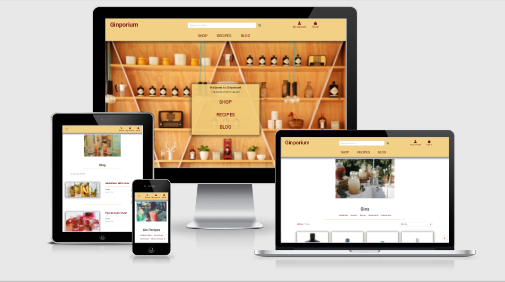
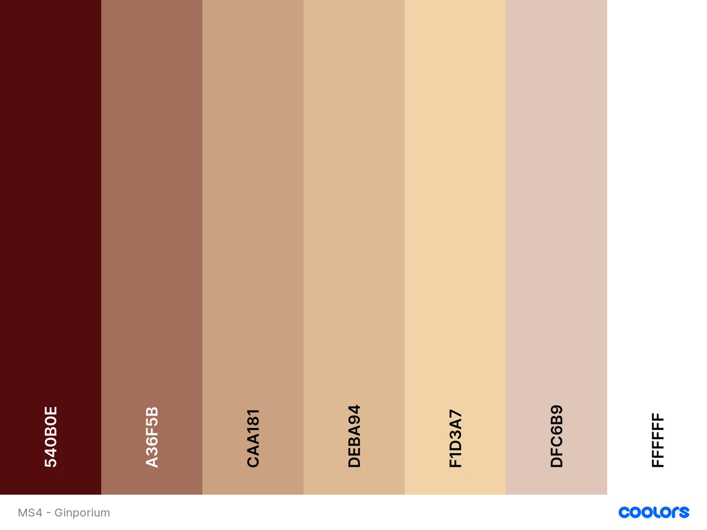

# Ginporium

## Introduction

This is my fourth milestone project; Designed to exhibit my capabilities and skills in Javascript, Python and Django as a student
of Code Institute. (https://codeinstitute.net/)
The goal was to showcase my skills to potential employers/recruiters, on a topic that I'm deeply interested in.
My website allows users to view a selection of gins, recipies for cocktails and read a blog on the latest gin trends. Upon creating a 
profile users will be able to purchase gins and leave comments on the blogs which can be edited and/or deleted as required. Delivery information 
will be stored on thier profile page and can be updated accordingly.
The website is easy to navigate through with a selection of dropdown menus and a search bar, within the fixed header, that are visiable on every page.
My website contains a landing page, complete with headline image and links to the other main pages of the site. Login and Register links are easily accessible
via the My Account dropdown and contain easy to use forms that can be used to gain access to all parts of the site open for the public.
Superusers will have access to the Management pages that allow them the option to add Recipes, Gins, and Blog posts and Edit/Delete them as required.
The app is colourful and engaging, drawing the user in with bright, bold images and standout text.

A link to my website can be found [here](https://''.herokuapp.com/)

## UX

### Goals-

The purpose of the site is to provide a simple, straightforward format presenting information about some popular gins, with the added option of being able to 
purchase the gins via a secure checkout. The website is designed for people interested in the various types of gins available and want an easy way to order and buy
them from the comfort of their own home. The recipes will hopefully entice users to try a new gin (or their favourite gin in a new way!) and will encourage continual
use of the site and repeat custom.
The website is fully functional and interactive giving the user a positive experience as they move throught the pages, with thourough explinations in regards to the forms
necessary within.
I focused on a design that would be colourful and engaging, with positive user experiences so users would be more inclined to make consistant use of the site.
The features implimented within the site have been carefully considered, with the users needs and business needs both taking an equal priority in the design and execution process.

### Wireframes -

I have produced a mock up of the websites pages. You can view them [here](./WIREFRAMES.md)

### Design -

#### Design Process -

1. _Strategy Plane_ - My primary aims were to give users a way to order and buy gins from the comfort of their own home, whilst encouraging repeat use of the service
and hosting a variety of choices to entice users into trying new flavours and styles.
I started the UX process by making a list of user stories, which allowed me to visualise what features would be necessary to meet both the user stories and primary aims,
in an engaging and simple way.

2. _Scope Plane_ - Having decided on the primary aims, I began outlining the key features that would need to be implemented to meet these aims and the user stories, in a user friendly way.
I focused on the Python and Javascript I would need to implement alongside the Django framework, as I knew this would be crucial to making the website interactive and secure.
C R U D functionality would need to be implemented within the site so users have the ability to Create, Read, Update and Delete delivery info within the shopping basket, and comments on the Blog, 
which will be another feature alongside the Recipes, to encourage continued site use by user involvement.
Forms will be a consistant feature throughout the site, not excluding the checkout, which will need to be secure, so they will need to be simple and explicit with user feedback a priority.
An enticing landing page, and profile page to store delivery information, will also be important features to implement and alongside layout of the products, will be crucial
to users continued use of the site and it's functions.

3. _Structure Plane_ - Once I had narrowed down the features I wanted to include, I formulated the structure of my design.
The landing page will be the first thing users see when visiting the site and therefore, along with a headline image, will need to express to the user exactly what the site is about.
It will also need to contain links to all the other pages - SHOP / RECIPES / BLOG.
The navbar will contain the relevent links to corresponding pages and, as an additional feature, will have dropdown menus to search for gins and recipes within categories, as well as browse them all
on one page, and will be visiable on every page across the site. The Blog page will list all the posts with the most recent at the top.
The navbar will also host a search bar.
There will be 2 pages that contain the Register and Login Forms, and these will be accessible through the My Account dropdown situated inside the navbar. When users are logged in this dropdown will
change to show the Profile page link and Logout links. 
(Logged in Superusers will also find links to the Manage Products, Manage Recipes and Manage Blogs pages which contain forms to add gins/recipes and blogs to the site).
All the gins within the site will contain a link directing users to a site page containing further information about that specific gin, with the option to add it to their shopping bag.
The shopping bag page will contain the product information, quantity, subtotal and grand total of all the items inside with a link to direct the user to the secure checkout page.
This secure checkout will contain a form to aquire delivery and billing information, and will generate a confirmation email, and the inputed order information to be displayed
on the users profile page along with the delivery info.
The links within the Blog page will direct the users to a page displaying the specific post chosen, and enable them to leave comments underneath for
other users to view. These comments can be Edited/Deleted if required, as can the delivery info on the Profile page.
Along with the Manage pages, Superusers will also have access to Edit/Delete buttons throughout the site which enable Editing and Deleting of Gins, Recipes and Blogs. 
Clicking Edit directs the Superuser to an auto-filled form to make the necessary changes. 
User feedback is a priority to positive user experience, therefore messages will be shown when the user carries out an action to inform them of the action being carried out, and of any other actions that may need addressing.
The site will use the Bootstrap framework to create a clean, uncluttered, intuitive layout. The layout will be responsive having been built from a mobile-first perspective.

- _Database Structure_ - The data needs to be structured in such a way that allows for the completion of orders and the cross communication of data, whilst 
maintaining that users get the correct orders and their information remains confidential. Stripe will be used to ensure payment information
remains confidential.
I used a data schema from [dbdiagram](https://dbdiagram.io/d/6030daf7fcdcb6230b20b183), to help visualise how the database would be structured. 
You can see my data schema [here](./DATABASE_STRUCTURE.md)

4. _Skeleton Plane_ - Navigating around the site will be simple and convienent. With the navbar, menu items with their respective dropdowns and the search bar,
users can move around the site using their prefered navigation method. When directed onto different site pages users will find instructive buttons
to move them forwards onto a different page or back to the previous one, and the navbar will be visiable across all pages if users prefer.
The multiple navigation techniques will give the users a comfortable and positive experience as they move throughout the site, encouraging 
continued site use.

5. _Surface Plane_ - To keep the user engaged whilst using the site, and encourage them to return, it has to appeal to the users tastes with regards to style, layout and colour.
I generated a colour scheme with [coolors](https://coolors.co/540b0e-a36f5b-caa181-deba94-f1d3a7-dfc6b9-ffffff), which provided a contrasting colour pallett, and found images that complemented it.
I kept the style and layout simple and clean, with clear, bright images where necessary and maintained the approach with regards to the font style and decoration.
Referring back to the user stories and primary aims, I developed mock up's with [figma](https://www.figma.com/file/vciIPdhnCDSDMJljVW9jLS/Ginporium) to plan out how I wanted my site to look, with the features the site needed and the users views and feelings taking priority
within this design process.

> Note: Throughout the design and development processes, I frequently referred back to the primary aims and user stories to make sure that my project was developing as intended.

#### Colour Pallette -

I used coolors to generate my colour scheme-

https://coolors.co/540b0e-a36f5b-caa181-deba94-f1d3a7-dfc6b9-ffffff

The colour scheme thoughout the site was kept neutral, in keeping with the tone of the site, and allowed for the images to stand out drawing the user in with their bold colours.
The name, 'Ginporium', was given the colour #540b0e as this added a pop of colour to the neutral background of #f1d3a7.
The My Account dropdown and Basket links were given a text colour of #deba94 which matches the text colour of the search function.   
Links were given a hover colour of #dfc6b9.
The SHOP, BLOG and RECIPES links were given a text colour of #deba94 on a black background.
All form elements and information was kept with a text colour of black (#00000) on a white background (#fff) so as not to distract the user when entering important information.
I tried to appeal to the tastes of the users when contemplating the colour scheme of the site, and with the target audience in mind, 
kept the decoration to a minimum and opted for a clean, fresh colour scheme to match the layout, with neutral colours to add a warm overtone and the occasional pop of colour
to keep things youthful.

#### Font -

## User Stories

### Target Audience -

The target audience will constist of people aged 18+ with an interest in different varieties of gin. The gin can be purchased from the comfort of your own home and delivered to your door, therefore avoiding busy supermarkets 
and shops appealing to those with busy schedules and/or the inabilty to access a local supermarket.
The site has a blog which explores what's going on in the world of gin, which will appeal to the younger side of the target audience, and a recipes page
which will encourage the target audience to try some of the other gins in stock. 
Those interested in using the site as superusers will appreiciate the ease and simplicity behind the running and maintenance of the site, with user friendly aspects for the
general public and themselves, with regards to adding/editing and deleting content.
Site security will appeal to every member of the target audience. When using the secure checkout functions in place, users will feel comfortable and confident that their data is being used confidentially.

### As a Site User -

- As a user, I want to choose and register my own username and password to something I can easily remember.

- As a user, I want the site to be easy to use and navigate.

- As a user, I want to find what I'm looking for quickly and easily.

- As a user, I want to view a list of products so I can select some to purchase.

- As a user, I want to view individual product details so I can identify the price, description and image.

- As a user, I want to view a specific category of products.

- As a user, I want the site to be interactive with real time feedback.

- As a user, I want to know how the site works and have easy to follow instructions.

- As a user, I want to know when I take the wrong action or when something doesn't work.

- As a user, I want to be able to add and edit content easily.

- As a user, I want the option to delete inputs if necessary.

- As a user, I want confirmation before deleting something.

- As a user, I want my information to remain confidential.

- As a user, I dont want other users editing/deleting my inputs.

### As a Site Superuser -

- As a site superuser, I want to choose and register my own username and password to something I can easily remember.

- As a site superuser, I want the site to be easy to use and navigate.

- As a site superuser, I want to find what I'm looking for quickly and easily.

- As a site superuser, I want the site to be interactive with real time feedback.

- As a site superuser, I want to know how the site works and have easy to follow instructions.

- As a site superuser, I want to know when I take the wrong action or when something doesn't work.

- As a site superuser, I want to be able to add and edit content easily.

- As a site superuser, I want the option to delete inputs if necessary.

- As a site superuser, I want confirmation before deleting something.

- As a site superuser, I dont want the public editing/deleting my inputs.

- As a site superuser, I want some parts of the site to be inaccessable to members of the public.

- As a site superuser, I want to be able to sell the stock on the website.

### As a Developer -

- As a web designer and developer, I want the app to be interactive and give real time feedback when a user executes an action.

- As a web designer and developer, I want my website to be user friendly with easy to navigate pages, and messages that tell the user when things aren't working as they should.

- As a web designer and delevoper, My website should leave the user feeling positive and with the knowledge they were looking for within the site. 
Information on the site should be presented in a simple, clean formatt, with no unexpected surprises for the user.

## Features

-   Responsive on all device sizes.

-   Interactive elements.

### Existing Features - 

#### Features Visiable across All Pages -

- _Navbar_ - Contains the site name, My Account dropdown, Basket, Search function, SHOP and RECIPE dropdown links, along with a link to the blog page.
The name is a link that will return the user to this landing page. The My account dropdown reveals the Login and Register links, and upon logging in, will reveal the 
My Profile and Logout links. Logged in superusers will also find the Manage Products, Manage Recipes and Manage Blog pages for adding content here.
The Basket link will take users to their shopping basket page. 
The search function allows users to input keywords that filter the content to meet the inputed criteria.
The SHOP and RECIPES dropdowns allow the users to search for gins and recipes within the categories specified.
The BLOG link will take users to the BLOG page.

- _Footer_ - Contains copywrite information and social media links.

- _Action Messages_ - Pop up messages that notify the user when an action has been carried out or couldn't be complied with. These messages can easily be dismissed by the user.

#### Features on the Landing Page -

- _Main Image_ - An image that conveys to the user what the site is about. It adds context and colour to draw the user in and contrasts with the navbar and text to give the site depth.

- _Page Links_ - Within the main image are links that will direct the user to the All Gins, All Recipies and Blog pages respectively.

#### Features on the Sign Up Page - 

- _Sign Up Form_ - Simple form, with explicit instructions on how to register for the site. The text is black with a white background to make it clear and legible, 
and form control gives the user realtime feedback on any fields that haven't been filled out correctly whilst ensuring the form doesn't get sent without the required information.
It includes an email field, confirm email, username, password and confirm password fields, with a link at the top to direct users who have already registered to the login page.

- _Back to Login Button_ - This button will direct users to the login page.

- _Sign Up Button_ - This button generates a verify email link, that is sent to the email address used in registration. Following that link will allow the user to use their login information 
on the sign up page and gain access to all areas of the site open to the public. It will also create a Profile page using the username inputed on the sign up form.

#### Features on the Sign In Page - 

- _Sign In Form_ - Simple form, with explicit instructions on how to log into the site. The text is black with a white background to make it clear and legible, 
and form control gives the user realtime feedback on any fields that haven't been filled out correctly whilst ensuring the form doesn't get submitted without the required information.
It includes a username and password field, with a link at the top to direct users who haven't registered to the Sign Up page.
Within the form there is also a remember me tick box which will save your login information for future visits.

- _Home Button_ - This button will enable the user to return to the landing page.

- _Sign In Button_ - This will sign the user into the site and onto the landing page.

- _Forgotten Password Link_ - Enables users to reset their password if they've forgotten it. It contains a link that directs users to simple, explicit instructions on how to reset their password. 

#### Features on the Gin Page - 

- _Page Title_ - A reminder to users that they're searching through the gins section of the site.

- _Product Count_ - This will notify users of how many products there are in total, if searching all gins, or how many gins are in the category, if searching via the SHOP dropdown.

- _Sort By Dropdown_ - Sort All Gins by price (high-low/low-high), alphabetically or by category.

- _Gin Home Link_ - When using the dropdown menus to search, a link back to the All Gins page will appear next to the product countdown.

- _Category Subheading_ - Using the SHOP dropdown menu will return the gins within that menu. A subheading will be visiable to remind the user what category they're searching within.

- _Gins_ - A list of gins in an uncluttered, clean layout; Complete with image, price and category information. The image will contain a link taking users to the gin information page.

- _Edit/Delete links_ - *Superusers Only* Superusers will also have access to the Edit/Delete links allowing them to delete products and directing them to the Edit page for editing purposes.

#### Features on the Gin Information Page - 

- _Gin Image_ - An image of the gin the information is referrencing. This gives users a visual referrence to exactly what they're paying for and will instill confidence when it comes to purchasing
the products.

- _Gin Name_ - The name of the gin and bottle size.

- _Price_ - The price it would cost to purchase one bottle of the gin. 

- _Category_ - The batabase category the gin is situated in.

- _Description_ - An indepth description of the gin including details on flavour. This text is designed to sell the product to the user in a subtle way.

- _Quantity_ - A function that allows users to input the amount of that product they want via -/+ buttons, with the amount displaying in the
text box between them. 

- _Keep Shopping Button_ - Directs users back to the all gins page.

- _Add to Basket Button_ - Adds the requested gin and quantity to the users basket.

- _Edit/Delete Buttons_ - *Superusers Only* Allows changes to be made to the gins via the Edit Products page. Clicking delete will remove that gin.

#### Features on the Recipes Page -

- _Page Title_ - A reminder to users that they're searching through the recipes section of the site.

- _Product Count_ - This will notify users of how many recipes there are in total, if searching all recipes, or how many recipes are in the category, if searching via the RECIPES dropdown.

- _Sort By Dropdown_ - Sort recipes by price (high-low/low-high), alphabetically or by category.

- _Recipes Home Link_ - When using the dropdown menus to search, a link back to the All Recipes page will appear next to the recipes countdown.

- _Category Subheading_ - Using the RECIPES dropdown menu will return the recipes within that menu. A subheading will be visiable to remind the user what category they're searching within.

- _Recipes_ - A list of cocktail recipes in an uncluttered, clean layout; Complete with image, ingredients and instruction sections. Cocktail recipes will encourage users to try different gins avaliable in throughout the site, with 
at least one different recipe for each gin in stock.

- _Edit/Delete links_ - *Superusers Only* Superusers will also have access to the Edit/Delete links allowing them to delete recipes and directing them to the Edit page for editing purposes.

#### Features on the Blog Page - 

- _Page Title_ - A reminder to users that they're within the blog section of the site.

- _Blog Image_ - An image that relates to the topic of the blog and adds colour and depth to the site, drawing users in. The image will also contain a link directing users to the Blog Information page.

- _Blog title_ - This gives a hint to users as to the context and topic of the post without giving all the information away.

#### Features on the Blog Information Page -

- _Blog Link_ - A link to direct users back to the all blogs page with a reminder of the current blog title alongside.

- _Blog Image_ - Repeated image from the blog page to clarify to users that they're on the page relating to that particular blog. The image also brings colour to the site page and draws users in with it's contrasting
colour against the black and white text, appealing to the users.

- _Date and Time Blog was Published_ - A date and time stamp, alongside the profile name of the super user who created the blog.

- _Blog Title_ - The name given to that post by the super user. It will match the name on the main blog page.

- _Blog Content/Body_ - The content of the blog. Written by the super user, it contains all the information relating to that topic. The text colour is black
on a white background to make it easy for users to read.

- _Comments_ - The comments section shows site users other users responses to the above blog. The ability to post responses to the blogs is through the form directly under this section on the site page. 
When no comments have been posted it will read 'No Comments Yet!'.

- _Comment Title_ - Posted comments, or blog responses, have titles given to them by the public user who created that comment.

- _Date and Time Comment was Published_ - Blog responses, also called comments, will be date and time stamped alongside the profile name of the user who commented.

- _Edit/Delete Comment Links_ - Situated under each individual blog response, these links give users the ability to Edit/Delete their comments, but will not allow them to edit/delete other users. They will only be visiable to the user who posted that particular response.

- _Leave a Comment Heading_ - Seperates the posted comments, from where users can leave their own comment. The heading is followed by a simple form with explicit instructions and form validation
that notifies users when the form has been filled out incorrectly. This ensures the form isn't submitted without the required information.

- _Comment Title Form Field_ - Users wanting to post a blog response or comment are required to give their comment a title.

- _Comment Content Form Field_ - This field is where users will input their response to the blog. 

- _Submit Comment Button_ - Clicking submit will post the comment underneath the blog in the comments section for all site users to see.

- _Back to Blog Button_ - This button takes the user back to the main blog page without submitting the blog comment.

#### Features on the Profile Page - 

- _My Profile Header_ - Reassures users they're on their profile page.

- _Delivery Information Form_ - This form contains users default delivery information. Enter the required information into the required fields before clicking the update information button, to update delivery information.
The information from this form will be automatically inputted into the checkout form when ordering form the site. Filling out the checkout form and clicking the tick box 'Save this delivery information to my profile'
will also update the information on this profile page. The form elements have black text on a white background to keep the fields legible and easy to read.

- _Form Fields_ - Consisting of Phone Number, Street Address 1, Street Address 2, Town or City, County, Postcode and Country dropdown. Enter the required information into the fields and select your country of residence from the list to 
complete the form. The simple form has explicit instructions and form validation that notifies the user when the form has been filled out incorrectly. This ensures the form isn't submitted without the required information.

- _Update Information Button_ - When users want to update their delivery information, fill out the fields in the form above with the required information and click this button to save the updated information to their profile.

- _Order History_ - Complete with order number, date, items and order total fields; This section provides users with their personal order history. The most recent order at the top.

#### Features on the Product Management - Add a Product - Page -

- _Product Management Header and Add Product Subheading_ - Referrence for super users. The subheading is there to reassure them they're on the right Product Management page.  

- _Form Fields_ - The form fields have explicit instructions and form validation that notifies users when the form has been filled out incorrectly. This ensures the form isn't submitted without the required information.
Users should type the required information straight into the form fields.

- _Category Form Field_ - Dropdown menu that allows the super user to choose the category that best applies to the new product, to add it into.

- _SKU Form Field_ -  

- _Product Name Form Field_ - This is the name of the product you want to add. 

- _Product Description Form Field_ - Add the product description here. This should contain specific information regarding the gin, such as the taste, and will need to sell the product.

- _Price Form Field_ - The price of one bottle that specific gin will be inserted here.

- _Image URL Form Field_ - Image URLs should start with http:// and can be copied and pasted in. If the image is stored on the computer/laptop in use, super users can use the Select Image button to search their files and upload the image from there.

- _Select Image Button_ - Allows super users to search through their computer files and upload an image from those rather than use the image URL.

- _Cancel Button_ - Directs users back to the All Gins page.

- _Add Product Button_ - Adds the new gin product to the database. The new gin will be visible on the All Gins page and when searching within the category chosen by the super user, using the dropdown menu. 

#### Features on the Product Management - Edit Product - Page -

- _Edit Product Form_ - Clicking the Edit link next to a gin will direct the user to that gins Edit page. This form contains the exact same form fields as the Add Product form and will be auto-filled with the current information relating to that gin.
To update this information just enter the new information into the correct field and click the Update Product button. The cancel button will return users to the All Gins page.

- _Form Fields_ - The form fields have explicit instructions and form validation that notifies users when the form has been filled out incorrectly. This ensures the form isn't submitted without the required information.

- _Current Image Preview_ - This is the current gin image.

- _Remove Tickbox_ - Ticking this box will remove the current image from that gin, and replace the current image and remove tick box form fields, with the Image URL form field.

- _Select Image Button_ - Allows super users to search through their computer files and upload an image from those rather than use the image URL.

- _Cancel Button_ - Directs users back to the All Gins page.

- _Edit Product Button_ - Adds the updated information to the database. The gins updated information will be visible on the All Gins page and when searching within the category chosen by the super user, using the dropdown menu, and within that gins information page. 

#### Features on the Product Management - Add a Recipe - Page -

- _Product Management Header and Add Recipe Subheading_ - Referrence for super users. The subheading is there to reassure them they're on the right Product Management page.  

- _Form Fields_ - The form fields have explicit instructions and form validation that notifies users when the form has been filled out incorrectly. This ensures the form isn't submitted without the required information.
Required information is inputed directly into the form fields.

- _Category Form Field Dropdown_ - Dropdown menu that allows the super user to choose the category that best applies to the new recipe, to add it into.

- _Image URL_ - Image URLs should start with http:// and can be copied and pasted in. If the image is stored on the computer/laptop in use, super users can use the Select Image button to search their files and upload the image from there.

- _Select Image Button_ - Allows super users to search through their computer files and upload an image from those rather than use the image URL.

- _Recipe Name Form Field_ - This is the name of the cocktail you want to add. 

- _Recipe Form Field_ - A list of ingredients and measurements required to make the cocktail.

- _Method Form Field_ - Directions as to how to make the cocktail.

- _Garnish Form Field_ - If the cocktail has garnish, add it here.

- _Cancel Button_ - Directs the user back to the All Recipes page without adding the recipe to the database. 

- _Add Recipe Button_ - Adds the new recipe to the database. The recipe can be viewed on the All Recipes page and via the dropdown menu

#### Features on the Product Management - Edit Recipe - Page -

- _Edit Recipe Form_ - Clicking the Edit link next to a recipe will direct the user to that recipes Edit page. This form contains the exact same form fields as the Add Recipe form and will be auto-filled with the current information relating to that recipe.
To update this information just enter the new information into the correct fields and click the Update Recipe button. The cancel button will return users to the All Recipes page.

- _Form Fields_ - The form fields have explicit instructions and form validation that notifies users when the form has been filled out incorrectly. This ensures the form isn't submitted without the required information.

- _Current Image Preview_ - This is the current recipe image.

- _Remove Tickbox_ - Ticking this box will remove the current image from that recipe, and replace the current image and remove tick box form fields, with the Image URL form field.

- _Select Image Button_ - Allows super users to search through their computer files and upload an image from those rather than use the image URL.

- _Cancel Button_ - Directs users back to the All Recipes page.

- _Edit Recipe Button_ - Adds the updated information to the database. The recipes updated information will be visible on the All Recipes page and when searching within the category chosen by the super user, using the dropdown menu. 

#### Features on the Product Management - Add a Blog - Page -

- _Product Management Header and Add Recipe Subheading_ - Referrence for super users. The subheading is there to reassure them they're on the right Product Management page.  

- _Form Fields_ - The form fields have explicit instructions and form validation that notifies users when the form has been filled out incorrectly. This ensures the form isn't submitted without the required information.
Required information is inputed directly into the form fields.

- _Image URL_ - Image URLs should start with http:// and can be copied and pasted in. If the image is stored on the computer/laptop in use, super users can use the Select Image button to search their files and upload the image from there.
Images should relate to the blog content.

- _Select Image Button_ - Allows super users to search through their computer files and upload an image from those rather than use the image URL.

- _Blog Name Form Field_ - This is the name of the blog you want to add. It should give users a hint as to the context and topic of the post without giving all the information away.

- _Blog Content/Body_ - The content of the blog. It should contain all the information relating to that topic. 

- _Cancel Button_ - Directs users back to the Blog page.

- _Add Blog Button_ - Adds the blog to the site and can be viewed via the blogs page.

#### Features on the Product Management - Edit Blog - Page -

- _Edit Blog Form_ - Clicking the Edit link next to a blog will direct the user to that blogs Edit page. This form contains the exact same form fields as the Add Blog form and will be auto-filled with the current information relating to that blog.
To update this information just enter the new information into the correct fields and click the Update Blog button. The cancel button will return users to the Blogs page.

- _Form Fields_ - The form fields have explicit instructions and form validation that notifies users when the form has been filled out incorrectly. This ensures the form isn't submitted without the required information.

- _Current Image Preview_ - This is the current blog image.

- _Remove Tickbox_ - Ticking this box will remove the current image from that blog, and replace the current image and remove tick box form fields, with the Image URL form field.

- _Select Image Button_ - Allows super users to search through their computer files and upload an image from those rather than use the image URL.

- _Cancel Button_ - Directs users back to the Blogs page.

- _Edit Recipe Button_ - Adds the updated information to the site. The updated blog information will be visible on the Blogs, and the Blog information pages. 

#### Features on the Shopping Basket - Empty - Page - 

- _Shopping Basket Header and Sub Heading_ - The heading reads 'Shopping Basket', with a sub heading of 'Your basket is empty.' This is for user clarification regarding what page they're on.

- _Keep Shoppping Button_ - Directs users to the All Gins page.

#### Features on the Shopping Basket - with Added Products - Page - 

- _Shopping Basket Header_ - The heading reads 'Shopping Basket'. This is for user clarification with reagrds to what page they're on.

- _List of Added Gins_ - The list contains a Product Info section, with image, product name and SKU , a price section which is the price it would cost to purchase one of those gins, a quantity function with -/+ keys to adjust the amount of bottles of that
particular gin in your basket (once the quantity has been adjusted click the update link to store this change), a subtotal section which is the total cost for that gin, this will increase if you up the quantity, and a remove link to remove the gin from your basket.

- _Basket Total_ - This is the total of all the gins in your shopping basket.

- _Delivery_ - This is the delivery charge that will get added to users basket total.

- _Grand Total_ - The sum of the basket total and delivery charge, and the total amount your order costs. This is the amount the users cards will be debted with.

#### Features on the Checkout Page - 

- _Checkout Header_ - The heading reads 'Checkout'. This is for user clarification with reagrds to what page they're on.

- _Form Fields_ - The form fields have explicit instructions and form validation that notifies users when the form has been filled out incorrectly. This ensures the form isn't submitted without the required information.
To fill out the form just enter the required information straight into the form fields. If users have previously ordered, or have saved delivery information to thier profile, these fields will be auto-filled with that information.

- _Save Information Tickbox_ - Ticking this saves the delivery information to the users profile page. If a field needs updating you can enter the updated information onto the checkout form and it will override the data on the profile page
if the 'Save this delivery information to my profile' box is ticked.

- _Payment Form Field_ - This box will require users card information. The card number, month/year, cvc and zip code.

- _Adjust Basket Button_ - Directs users back to the Basket page.

- _Complete Order Button_ - Processes the users payment and order. It also generates a confirmation email sent to the email address used in the checkout form. A loading window will follow this page whilst the payment is processing.

- _Card Charge Warning_ - A reminder that the users card will be debted with the stated amount.

#### Features on the Thankyou Page - 

- _Thankyou Header_ - The heading reads 'Thankyou'. This is for user clarification with reagrds to what page they're on. It will also be accompanied by a statement thanking users for ordering and explaining that a confirmation email has been sent.
This page contains the order information, which can also be found in the confirmation email and will now be present on their profile page.

- _Information Fields_ - Containing information regarding the order just placed by the user, including, order number, order date, delivery information and billing information.
These fields are for a referrence only can't be adjusted by the user.

- _Checkout Our Gins!_ - Directs users back to the All Gins page.

### Features left to Implement -

- _Refunds_ - The ability to issue refunds through the website.

- _Add seperate shipping and billing addresses_ - Allow the user to choose a delivery address thats different to the billing address.

- _Store Customer Card information_ - Use stripe to store the customers card information for future purchases.

- _Super User Comment Deletion_ - Give super users the ability to delete public users comments if necessary.

- _Social Media Login_ - Allow users to login via social media accounts.

- _Alternative Payment Method_ - Add Google and Apple pay.

### Bugs and Fixes Implemented after Testing -

- _Added Verify Email Page_ - Upon registering, a page has been added that tells users to verify their emails using a link emailed to the email address used in registration, before continuing.

- _Added Verify Logout Page_ - Requests users to verify if they're sure they wish to logout.

## Technologies Used

### Languages -

1. **HTML, or Hyper Text Markup Language:** Used to construct the page withn this app -   
https://developer.mozilla.org/en-US/docs/Web/HTML

2. **CSS, or Cascading Style Sheets:** Used to style the various elements on the app's pages via coloring, fonts, spacing, etc. - 
https://www.w3.org/Style/CSS/Overview.en.html

3. **Javascript:** A programming language - https://www.javascript.com/

4. **JQuery:** A programming language - https://jquery.com/

5. **Python3:** A programming language - https://www.python.org/

6. **Jinja:** A programming language - https://jinja.palletsprojects.com/

7. **Bson and Json:**  A computer data interchange format - https://www.mongodb.com/json-and-bson

### Libraries -

1. **Bootstrap:**  Front-end Open Source Toolkit -  https://getbootstrap.com/

2. **Font Awesome:** Icon library - https://fontawesome.com/

3. **Google Fonts:** A library of free licensed font families - https://fonts.google.com/

### API's - 

1. **Django:** A web framework - https://www.djangoproject.com/

2. **Stripe:** Payment system - https://stripe.com/gb

### Email Services -

1. **Gmail:** Google mail; The process of sending and receiving electronic messages that may contain text, graphics, images or videos - https://www.google.com/intl/en_uk/gmail/

### Databases -

1. **Postgres:** Open Source Database - https://www.postgresql.org/

2. **sqLite:** SQL Database Engine - https://www.sqlite.org/

3. **AWS:** Amazon Web Services Database Storage - https://aws.amazon.com/

### Tools -

1. **Gitpod:** An online IDE also used for creating & saving code that runs in a browser, it does not have to be installed on your PC - 
https://www.gitpod.io/

2. **Git:** A version control system for tracking changes in source code during software development - https://git-scm.com/

3. **Github:** A company that provides hosting for software development version control using Git. It is a subsidiary of Microsoft - https://github

4. **Heroku:** An application platform. allowing users to build, run and operate applications - https://www.heroku.com

5. **Django Secret Key Generator:** Generates Django secret keys - https://miniwebtool.com/django-secret-key-generator/

6. **Temporary Email Address:** Creates disposable, temporary email addresses - https://temp-mail.org/en/

7. **Chrome DevTools:** A set of web developer tools built directly into the Google Chrome browser. I used these tools constantly thoughout the development cycle -
   https://developers.google.com/web/tools/chrome-devtools

8. **W3C Markup Validation Service:** Used to run all html and css code through a validation process looking for errors - https://validator.w3.org/
   https://jigsaw.w3.org/css-validator/validator

9. **Pep8:** Python Validator used to run all python code through to look for errors -  http://pep8online.com/

10. **JSHint:** Javascript Validator used to run all JS code through looking for errors - https://jshint.com/

11. **Free Formatter:** A HTML formatter that Formatted my HTML 2 spaces per indent - https://www.freeformatter.com/

## Testing

I carried our substantial testing on all of my apps pages and links. You can see the results of the tests [here](./TESTING.md)

### Validation of Code Testing -

#### HTML - 

#### CSS -

#### Javascript -

#### Python -

## Deployment

This website was developed in Gitpod and pushed to the remote repositories, GitHub and Heroku. The live page is hosted on Heroku.

### Used Commands during Deployment -

### Hosting on Heroku -

### Forking the GitHub Repository -

### Running this Project Locally -

## Credits

### Content -

1. Gin information and cocktail recipes 

- [Gordons](https://www.gordonsgin.com/)

- [Tanquary](https://www.tanqueray.com/)

- [Hendricks](https://www.hendricksgin.com/)

2. Colour Scheme 

- [Coolors](https://coolors.co/)

3. Wireframes 

- [Figma](https://www.figma.com/)

4. Data Schema

- [DBDiagram](https://dbdiagram.io)

### Media -

1. Images

- Bottles and cocktail images from [Hendricks](https://www.hendricksgin.com/)

- Bottles and cocktail images from [Tanquary](https://www.tanqueray.com/)

- Bottles and cocktail images from [Gordons](https://www.gordonsgin.com/)

- Main Image from [Pexels](https://www.pexels.com/)

2. Table of contents 

- [ecotrust-canada](http://ecotrust-canada.github.io/markdown-toc/)

3. Responsive Image

- [Am-I-Responsive](http://ami.responsivedesign.is/)

4. Tutorial Videos

- [Code-Institute](https://codeinstitute.net/)

- [Corey-Schafer](https://coreyms.com/)

- [Codemy](https://www.youtube.com/watch?v=B40bteAMM_M&list=PLCC34OHNcOtr025c1kHSPrnP18YPB-NFi)

5. Icons and Buttons 

- [Font-Awesome](https://fontawesome.com/)

### Acknowledgements -

1. My fantastic mentor Seun Owonikoko for her help and many other pieces of advice alongside motivation to get me through.

2. Code Institute's [Slack](https://app.slack.com/client/T0L30B202/C0L316Z96) Channels and the many incredible alunni, mentors, tutors and users who contribute to them; the many pinned announcements, 
pdf files, etc. were of great help, as was the advice and motivation given by the many members.

3. The amazing Code Institute Tutors and Student Care team.

## Disclaimer

#### This website was made for educational purposes only