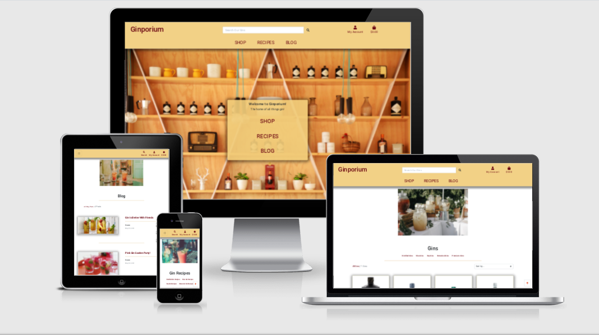

# Ginporium

- [Ginporium](#ginporium)
  * [Testing](#testing)
    + [Manual Testing](#manual-testing)
    + [Compatibility and Responsiveness](#compatibility-and-responsiveness)
    + [Open Issues](#open-issues)

## Testing

I carried our substantial testing on all of my sites pages and links.

http://ami.responsivedesign.is/ has been used to see how the site performs on different Apple devices and their viewports, all links, icons performed as expected on all devices.
I also used it to create the AppleDevicesView.png at the top of this Readme.

### Manual Testing

- Google Chrome Browser; all feature links and icons perform well on all viewport sizes. Developer tools were also used on browser for the various viewport sizes. 
The webpages are responsive as are the images, info windows and forms, whilst retaining user freindly design aspects.
The images did not appear streched or pixilated and remained sharp and clear throughtout the site.

- Safari Browser; all feature links and icons perform well on all viewport sizes. Developer tools were also used on browser for the various viewport sizes. 
The webpages are responsive as are the images, info windows and forms, whilst retaining user freindly design aspects.
The images did not appear streched or pixilated and remained sharp and clear throughtout the site.

- Various browsers and devices; the project was shared in the peer-code-review CI slack room and was tested by other CI Students, Mentors, Alumni and Tutors. 

> Note: The developer used dev tools to check the resposiveness of all the apps pages, using the dropdown burger menu, to click every page link. The 'Top' button was pressed on every page to test for the required action on smaller screen sizes, with the correct response given. 
        The images were viewed and buttons all pressed on various browser sizes in dev tools to check responsiveness, along with forms and the search bar. 
        All pages and thier contents were fully responsive whilst maintaining user friendly design aspects.

* This is in direct relation to the 'Goals' and 'User Stories' from the 'UX' Section.

    The results of this were -

    1. Users can choose thier own username and password.

    2. Users can find what they're looking for quickly and easily, using the navbar, search bar, categories and sort by dropdown.

    3. Links in the navbar are labelled clearly.
    
    4. Users can view a list of products and select some to purchase.

    5. Users can view a specific items details in a seperate window.

    6. The app is easy to use and has easy to follow instructions, with user feedback when an action has been carried out using toasts messages.

    7. Users are notified if thier imputs are successful and have been denied.

    8. Users can add, edit and delete inputs easily

    9. Users payment information is handled securely via stripe.

    10. Having the forms within the 'Edit' buttons autofill, saves user time and repetition.

    11. Only the comment author and superuser can delete and edit a users comments.

    12. Some parts of the site are only accessable to super users.

    13. Users can purchase items quickly.

    14. Unregistered users can still purchase items.

    15. It's colorful and engaging.

    16. The site has been designed to be fluid and never to entrap the user.
    
    17. The 'Top' button takes users back to the top of the page ensuring they always have somewhere to go and don't feel trapped as they get to the bottom of the page.
    
* A super user and regular user were created to test the elements only accessable to superusers stays hidden to regular users.
* All buttons, forms and links were clicked and tested for responses, all form fields were filled out and responded as expected, all features were used and tested with appropriate responses given as a logged in user, superuser and unregistered user.
* All buttons were tested by the developer to check that they responded correctly and displayed the correct information.
* All links were tested by the developer to check they lead to the correct endpoints and gave the correct responses.
* All gin and recipe categories were tested by the developer to check that it responded correctly and displayed the correct information.
* All forms were tested by the developer by filling them out using the wrong inputs to test validation and user feedback, which worked as expected. A red underline and text box appears alerting the user to the mistake.
* Edit forms were tested by changing the information and viewing those changes on thier respective pages. Edit forms were also pre-filled with the current information as programmed.
* All 'Delete' buttons delete the appropriate information and take users back to the all gins, all recipes and main blog pages respectively. 
* The back to top button takes the user to the top of the current page and has been tested and reponded as expected on every page.
* Toasts give the user real time feed back on thier inputs and are visiable with bold, clean text to grab the users attention. They show at the approprite time and with the correct text in all circumstances.

_Landing Page_ -
* Clicking the links within the jumbotron on the image take users to the pages specified.
* Clicking the links within the shop dropdown take users to the gin categories specified or the all gins page if requested.
* Clicking the links within the recipes dropdown take users to the recipe categories specified or the all recipes page if requested.
* Clicking the Blog link takes users to the all blogs page.

_Search Bar_ -
* The search bar was tested by entering information completely irrelevent to the site which showed the programmed message 'No Results Found!', and the item count read 0.
* The search bar in the header generates results based on user input. Results are listed underneath. Words relevent to the site were searched all returning the correct information.

_Login Page_ -
* The form fields have validation and were tested using correct and incorrect information with the expected responses given.
* Clicking the home button takes users to the main langing page.
* Clicking the login button takes the user to the sites main landing page, which has links to all other areas of the site, upon correct entry of thier personal username and password, and the link to the 'Register' page transports the user to that page as expected.
* Clicking the forgot password button takes users through the process of setting a new password.

_Register Page_ -
* The form fields have validation and were tested using correct and incorrect information with the expected responses given.
* Clicking the back to login and sign in links take users back to the login page as stated and expected.
* Clicking the register button registers that users username and email address and sends the user an email asking them to validate thier email address before directing them back to the login page.

_Gins Pages - Via Shop Dropdown_ -
* All the links in the gin dropdown list take the user to the gins within that category.
* The result of the users input is shown below with only the gins in that category visiable.
* The page has a header to remind users of the category they're searching in and an item count so they can see how many gins are in that category, next to a link that directs them to the all gins page.
The item count was tested by entering and removing gins from the DB and updates accordingly.
* The sort by dropdown is available for users to sort the gins within the chosen category, it was tested by clicking all the availble sorting methods and observing the results, which were as expected.
* Both the gin image and gin name take the user to that specific gins details page.

_All Gins Page - Via Shop Link within Image_ -
* This link directs users to the all gins page.
* The page has an item count so users can see how many gins there are in total. The item count was tested and updates when gins are added and removed from the DB.
* A sort by dropdown is available for users to sort the gins within the page. The sort by was tested by clicking on every available method and observing the results visiable underneath.
The results were as expected on every method.
* Both the gin image and gin name take the user to that specific gins details page.

_Gin Details_ -
* Show all the details with regards to the specific gin.
* A category link takes users to that gins category, where they will find other gins within that category if there are any within the DB. It was tested by clicking on every available method and observing the results visiable underneath.
* Users can use the amount - and + icons to select the amount of that gin type to add to the basket. This has been tested with every gin and the amount specified here will be added to the users shopping basket. 
* Superusers will find the Edit and Delete buttons here. They are not visible to non-superusers and were tested by creating a regular user.
* A continue shopping link directs users to the all gins page whilst saving their current shopping basket.
* The add to basket button adds the specified amount of the specified gin to the users shopping basket. Users are notified of the success of this or if there's been an error.

_Edit Gin Button_ -
* Only super users have access to this button (found on Gin Details page), and it was tested by creating a regular user.
* Clicking the 'Edit' buttons take the user to a form with the fields filled out with the current information and the 'Edit' button within the forms changes the information within the DB, before taking the user back to that gins details page.
* The form fields have validation and were tested using correct and incorrect information with the expected responses given.
* The current image section shows a thumbnail of the current image with the option to remove it (checkbox), select a new image from the computers files (select button) or add an image using the image url field.
All 3 methods were tested and gave appropriate responses.
* Clicking the 'Cancel' buttons take the user back to thier respective details page without making changes as expected.
* Users are notified of the success of this or if there's been an error.

_Gin Management_ -
* Only super users have access to this page (found in My Account dropdown), and it was tested by creating a regular user.
* Clicking the 'Add' buttons add the entered information to the DB before taking the user back to the gins details page.
* The form fields have validation and were tested using correct and incorrect information with the expected responses given.
* Users can select a new image from the computers files via the select button or add an image using the image url field.
Both methods were tested and gave appropriate responses.
* Clicking the 'Cancel' buttons take the user back to thier respective details page without making changes as expected.
* Users are notified of the success of this or if there's been an error.

_Recipes Pages - Via Recipes Dropdown_ -
* All the links in the recipes dropdown list take the user to the recipes within that category.
* The result of the users input is shown below with only the recipes in that category visiable.
* The page has a header to remind users of the category they're searching in and an item count so they can see how many recipess are in that category, next to a link that directs them to the all recipes page.
The item count was tested by adding and removing recipes from the DB and updates accordingly.
* A sort by dropdown is available for users to sort the recipes within the chosen category. The sort by was tested by clicking on every available method and observing the results visiable underneath.
* Superusers will find the Edit and Delete buttons here. They are not visible to non-superusers and were tested by creating a regular user.

_All Recipes Page - Via Recipes Link within Image_ -
* This link directs users to the all recipes page.
* The page has an item count so users can see how many recipes there are in total. The item count was tested and updates when recipes are added and removed from the DB.
* A sort by dropdown is available for users to sort the recipes within the page. The sort by was tested by clicking on every available method and observing the results visiable underneath.
The results were as expected on every method.
* Superusers will find the Edit and Delete buttons here. They are not visible to non-superusers and were tested by creating a regular user.

_Edit Recipe Button_ -
* Only super users have access to this button and it was tested by creating a regular user.
* Clicking the 'Edit' buttons take the user to a form with the fields filled out with the current information and the 'Edit' button within the forms changes the information within the DB, before taking the user back to the all recipes page.
* The form fields have validation and were tested using correct and incorrect information with the expected responses given.
* The current image section shows a thumbnail of the current image with the option to remove it (checkbox), select a new image from the computers files (select button) or add an image using the image url field.
All 3 methods were tested and gave appropriate responses.
* Clicking the 'Cancel' buttons take the user back to the all recipes page without making changes as expected.
* Users are notified of the success of this or if there's been an error.

_Recipe Management_ -
* Only super users have access to this page (found in My Account dropdown), and it was tested by creating a regular user.
* Clicking the 'Add' buttons add the entered information to the DB before taking the user back to the all recipes page.
* The form fields have validation and were tested using correct and incorrect information with the expected responses given.
* Users can select a new image from the computers files via the select button or add an image using the image url field.
Both methods were tested and returned appropriate responses.
* The 'Cancel' buttons take the user back to the all recipes page without making changes as expected.
* Users are notified of the success of this or if there's been an error.

_Blog page - Via Blog Nav Link_ -
* The page has an item count so users can see how many blog posts there are in total. The item count was tested and updates when posts are added and removed from the DB.
* Clicking the blog image takes the user to that specific posts details page.

_Blog page - Via Link within Image_ -
* This link takes you to the same page, with the same elements as the link in the nav bar. (Discussed above)

_Blog Details_ -
* Users must be logged in to use this feature. This was tested using a username that wasn't logged in and was directed to the login page as expected.
* Superusers will find the Edit and Delete post buttons here. They are not visible to non-superusers and it was tested by creating a regular user.
* Clicking the back to blogs button directs users back to the all blogs page.
* The add a comment form is found under the blog post. (Discussed below)  
* The comments section has an item count so users can see how many comments there are on that post. The item count was tested and updates when comments are added and removed from the DB.
* Super users and the comment authors will find the edit and delete comment buttons under the comments. Superusers can delete posts by all users but if users aren't superusers they can only edit and delete thier own comments. This was tested by creating posts by both superusers and 2 non-superusers and viewing the results, which were as expected.
* If a blog hasn't got any comments users will be informed via a 'No comments yet!' statement. This has been tested by adding a blog and not commenting.

_Edit Post Button_ -
* Only super users have access to this button and it was tested by creating a regular user.
* Clicking the 'Edit' buttons take the user to a form with the fields filled out with the current information and the 'Edit' button within the forms changes the information within the DB, before taking the user back to that posts details page.
* The form fields have validation and were tested using correct and incorrect information with the expected responses given.
* The current image section shows a thumbnail of the current image with the option to remove it (checkbox), select a new image from the computers files (select button) or add an image using the image url field.
All 3 methods were tested and gave appropriate responses.
* Clicking the 'Cancel' buttons take the user back to that posts details page without making changes as expected.
* Users are notified of the success of this or if there's been an error.

_Blog Management_ -
* Only super users have access to this page (found in My Account dropdown) and it was tested by creating a regular user.
* Clicking the 'Add' buttons add the entered information to the DB before taking the user back to the posts details page.
* The form fields have validation and were tested using correct and incorrect information with the expected responses given.
* Users can select a new image from the computers files via the select button or add an image using the image url field.
Both methods were tested and gave appropriate responses.
* Clicking the 'Cancel' buttons take the user back to thier respective details page without making changes as expected.
* Users are notified of the success of this or if there's been an error.

_Edit Comment Button_ -
* Only super users and that comments author have access to this button.
* Superusers can delete comments by all users but if users aren't superusers they can only edit and delete thier own comments.This was tested by creating comments by both superusers and 2 non-superusers and viewing the results, which were as expected.
* Clicking the 'Edit' buttons take the user to a form with the fields filled out with the current information and the 'Edit' button within the forms changes the information within the DB, before taking the user back to the main blog page.
* The form fields have validation and were tested using correct and incorrect information with the expected responses given.
* Clicking the 'Cancel' buttons take the user back to the main blog page without making changes es expected.
* Users are notified of the success of this or if there's been an error.

_Add Comment_ -
* Users must be logged in to use this feature. Users who aren't logged in are directed to the login page and was tested using a user who wasn't logged in.
* Clicking the 'Add' buttons add the entered information to the DB before refreshing the posts details page to show the added comment.
* The form fields have validation and were tested using correct and incorrect information with the expected responses given.
* Clicking the 'Cancel' button take the user back to the top of the posts details page without making changes as expected.
* Users are notified of the success of this or if there's been an error. 

_My Account Dropdown_ -
* The 'My Account' dropdown, when logged in, shows relevant information dependant on if you're a non-superuser or superuser, with superusers getting the added management pages, alongside the profile and logout links.
This was tested using superuser and non-superuser credentials.
* Using the 'My Account' dropdown users will be taken to the pages stated, with a confirmation of input required before logging them out via the logout button. Pressing cancel at this point takes users to the main landng page.
* Unregistered users and users who aren't logged in will see login and register links. This was also tested using superuser and non-superuser credentials.

_Profile Page_ -
* The users username appears at the top as programmed with thier email displayed underneath. This was tested using 3 users credentials with the correct information displayed every time.
* The profile page displays the users username and email address with a table of all thier previous orders and current delivery information.
* Clicking the order numbers, within the order history table, directs users to a page with all the information relative to that order diplayed. A reminder that the user is viewing an old order 
is also diplayed, with a link which takes users back to the profile page.
* The current delivery information section has fields that can be edited with updated information and saved using the update information button.
The information stored in this form will be automatically generated within the checkout form when a user is logged in and has been tested by changing the users information.
The form has validation with explicit instructions when it's incorrect and was tested with both correct and incorrect information with the expected results.
* This page is only accessable to a logged in user and was tested using a username that wasn't logged in.

_Basket Icon_ -
* The Basket icon in the navbar takes users to thier shopping baskets, where they will find a list of all the gins they've added to it alongside some important information. If the basket is empty
users will be faced with a comment expressing that and a link which directs them to the all gins page. This was tested by clicking the empty basket and clicking the basket with items inside and viewing the reults, which were as stated.
* Users who have items in thier baskets will be faced with the option to update item amounts and delete items from thier baskets. Both the + and - buttons update the number within the box field, and the update and delete buttons update the subtotal, basket total, delivery and grand total to reflect the changes.
If all the items are removed from the basket, users will be directed to a page stating that thier basket is empty and a link which takes them to the all gins page.
* Clicking the continue shopping link directs users to the all gins page.
* Clicking the checkout button takes users to the checkout page where they find an order summary alongside an order form. 

_Checkout Page_ -
* All form fields work as intended and have validation that tells users if it's not been filled out correctly.
The form was tested using correct and incorrect information, and gave the expected results and validation instructions.
* Clicking the 'Save delivery info to profile' box, saves just the delivery sections users details to thier profile page, which can be accessed via the 'My Account' dropdown. If the user has information saved to their profile, the delivery form fields will
be automatically generated with the stored info. Any information changes made on this form update the info on the profile page when the save info box is checked.
This was tested by changing the information and observing the results on both pages.
* Clicking the basket link takes users back to thier basket.
* Clicking the checkout button generates the payment through stripe, adding the order to the admin section of the site and the users profile page. This was tested using multiple users and making orders then viewing the reults, which were as expected. 
* The 'warning card is about to be debited' message updates with the basket user entries such as updating the amount of gin and was tested by doing so.

_Thankyou_ -
* When users have checked out and paid, they are directed to a thankyou page with a copy of thier order and a link which directs the to the all recipes page.
Users are also sent a copy of thier order to the email they suppied in the form on the checkout page. This has been tested multiple times, giving correct responses every time.
Users are notified of the email on the thankyou page alongside the email address.

### Compatibility and Responsiveness

The device emulator by Google Chrome's developer tool was used to check the responsiveness across all the different screen sizes and devies to ensure compatibility and responsiveness to a screen minimum of 300. 
The images were viewed and buttons all pressed on various browser sizes to check responsiveness, along with forms and the search bar. The 'Top' button was pressed on every page to test for the required action on smaller screen sizes, with the correct response given
and the dropdown burger menu was used, to click every page link. 
All pages and thier contents were fully responsive whilst maintaining user friendly design aspects.
This website has been tested on multiple browsers (Chrome, Safari, FireFox).
IPhone 11 (iOS 14.1) was used to test for mobile testing.
Ipad mini and Ipad Pro are used for medium screen testing.

### Open Issues

* When editing a comment the edit and cancel buttons take users to the main blog page instead of to the posts details page where the comment was origionally made.

* When editing, adding and deleting, recipes, blogs, comments and gins in some views the shopping basket appears in the success message toast if the basket isn't empty.

* Sometimes the webhook will duplicate orders if there's a time delay on my order form. This is a race issue and unfortunatly I didn't have the time to implement other stripe features to overcome this.

** Back to [README.md](./README.md) **
